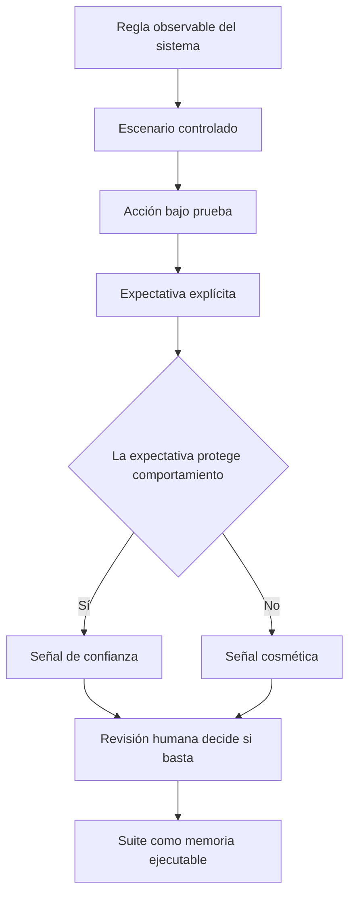

# Fundamentos de testing

**Estado:** draft

## Introducción

Este capítulo abre el curso con una pregunta que parece simple y no lo es:
¿qué prueba realmente una prueba?

Testing no es una lista de macros ni un trámite para subir cobertura. Testing
es una forma de escribir evidencia sobre el comportamiento esperado de un
sistema. Esa evidencia no reemplaza el criterio humano, pero reduce el espacio
donde los cambios pueden romper algo sin ser vistos.

## Concepto

Una prueba es una observación controlada sobre un comportamiento. Toma una
entrada, prepara un contexto, ejecuta una acción y compara el resultado con una
expectativa. Lo importante no es solo que la comparación pase, sino que la
expectativa represente una regla valiosa del sistema.

Por eso una buena prueba comunica tres cosas:

- qué comportamiento importa;
- bajo qué condiciones debe sostenerse;
- qué señal aparece cuando se rompe.

Una suite de pruebas es el conjunto de esas observaciones. No demuestra que el
sistema sea perfecto; demuestra que ciertas propiedades siguen siendo ciertas
en los casos que decidimos volver ejecutables.

## Motivación

El software cambia. Cada cambio puede romper una regla anterior, introducir una
regla nueva o revelar que nunca entendimos bien una frontera. Sin pruebas, la
confianza depende de memoria, intuición y revisión manual completa cada vez.

Ese modelo no escala. Un sistema real acumula casos límite, invariantes,
contratos entre módulos y decisiones históricas. Si esas decisiones solo viven
en la cabeza de alguien, se pierden o se reinterpretan. Las pruebas convierten
parte de esa memoria en evidencia ejecutable.

## Problema

El problema de fondo no es escribir más pruebas. El problema es escribir
pruebas que produzcan una señal útil. Una prueba que solo ejecuta código sin
afirmar una regla puede pasar durante años y no proteger nada importante.

Una suite pobre suele fallar por tres razones:

- confunde ejecución con evidencia;
- protege detalles internos en vez de comportamiento observable;
- deja fuera los bordes donde la regla realmente se rompe.

El curso parte de esa distinción. Primero se nombra la regla, después se elige
el tipo de evidencia y finalmente se decide qué huecos siguen vivos.

## Qué puede probar una prueba

Una prueba puede verificar que una expectativa concreta se cumple en un
escenario definido. Puede hacer visibles regresiones, contratos rotos, errores
de borde y decisiones de diseño que alguien intentó cambiar sin querer.

También puede documentar comportamiento. Un lector que ve una prueba bien
nombrada entiende qué caso le importó al autor y por qué esa regla merece
protección.

## Qué no puede probar una prueba

Una prueba no demuestra ausencia total de errores. Tampoco demuestra que el
diseño sea correcto, que el producto resuelva el problema correcto o que la
suite cubra todos los escenarios relevantes.

La cobertura de líneas tampoco equivale a confianza. Puede indicar que el
código se ejecutó, pero no que las expectativas sean fuertes. Una suite puede
tener cobertura alta y aun así no detectar mutaciones triviales, contratos
ambiguos o decisiones de negocio mal entendidas.

## Alternativas

La primera alternativa es confiar en pruebas manuales. Sirven para exploración,
criterio de producto y revisión humana, pero son costosas de repetir y fáciles
de olvidar.

La segunda alternativa es probar solo al final. Esto detecta errores tarde,
cuando el costo de entender la causa ya subió y el diseño quizá quedó rígido.

La tercera alternativa es perseguir cobertura como objetivo. Da una métrica
visible, pero puede convertir la suite en teatro: mucho código ejecutado y poca
confianza real.

La alternativa que toma este curso es tratar las pruebas como diseño
ejecutable. Primero se entiende la regla, luego se decide qué evidencia la
protege y finalmente se implementa una prueba que pueda fallar por una razón
clara.

## Teoría

El vocabulario mínimo del capítulo tiene cuatro piezas.

**Regla observable:** comportamiento que una persona del sistema puede explicar
sin mencionar detalles internos. Por ejemplo: "rechaza una contraseña más
corta que el mínimo permitido".

**Escenario controlado:** contexto suficiente para volver repetible la regla.
El escenario fija entradas, estado inicial y dependencias relevantes.

**Expectativa explícita:** afirmación que permite distinguir éxito de falla.
Sin expectativa, la prueba solo demuestra que algo se ejecutó.

**Señal de confianza:** fuerza de la evidencia producida. Una señal local
protege una regla pequeña. Una señal de comportamiento protege una propiedad
observable. Una señal sistémica protege interacción entre componentes o
contratos.

Esta teoría no elimina el criterio humano. Lo vuelve discutible. Cuando una
prueba falla, la suite debe ayudar a preguntar: ¿se rompió la regla, cambió el
diseño o la prueba estaba mal escrita?

## Diagrama

El flujo mental del capítulo es deliberadamente pequeño:



El mismo diagrama vive en `diagrams/01-fundamentos-de-testing.mmd` para que el
sitio pueda renderizarlo después sin copiarlo a mano.

## Complejidad

Este capítulo todavía no introduce complejidad algorítmica. La complejidad que
importa aquí es cognitiva: cuántas razones distintas pueden explicar que una
prueba pase o falle.

Una prueba con pocas causas de falla produce mejor señal. Si una falla puede
venir de red, tiempo, azar, orden de ejecución, detalles internos y regla de
negocio al mismo tiempo, el lector no recibe evidencia clara; recibe ruido.

Por eso el modelo Rust del capítulo degrada la confianza cuando aparecen
huecos conocidos como no determinismo, acoplamiento a implementación o falta
de frontera.

## Invariantes del curso

- Una prueba debe proteger una regla observable.
- Una prueba debe fallar por una razón comprensible.
- Una prueba debe tener un nombre que explique el comportamiento, no el detalle
  interno.
- Una prueba debe minimizar causas accidentales de falla.
- Una suite debe combinar escalas: unidad, integración, contrato, propiedades y
  rendimiento cuando aplique.
- Una métrica de testing es señal, no objetivo.
- La revisión humana sigue decidiendo si la evidencia es suficiente.

## Implementación

El modelo mínimo del capítulo vive en `src/fundamentals.rs`. Representa
afirmaciones de prueba, tipos de evidencia, huecos conocidos y señales de
confianza. No usa frameworks externos: el objetivo es hacer visible el
razonamiento antes de conectar herramientas.

Ese modelo debe permitir expresar preguntas como:

- ¿qué comportamiento se afirma?
- ¿qué tipo de evidencia lo protege?
- ¿qué riesgo queda fuera?
- ¿la señal es fuerte o solo cosmética?

El módulo no intenta ejecutar pruebas por su cuenta. Enseña el vocabulario que
después usarán los capítulos sobre unit tests, integración, contratos,
propiedades y rendimiento.

La pieza central es `TestClaim`: una afirmación formada por comportamiento,
tipo de evidencia y huecos conocidos.

```rust
use rust_testing::fundamentals::{
    ConfidenceGap, ConfidenceSignal, EvidenceKind, TestClaim,
};

let claim = TestClaim::new(
    "sincroniza inventario entre catálogo y carrito",
    EvidenceKind::Integration,
)?
.with_gap(ConfidenceGap::NonDeterministic);

assert_eq!(claim.signal(), ConfidenceSignal::Behavioral);
# Ok::<(), rust_testing::fundamentals::ClaimError>(())
```

El ejemplo empieza como evidencia sistémica porque cruza componentes. Sin
embargo, el hueco de no determinismo baja la señal: si falla por azar o por
estado externo, la suite ya no comunica con precisión qué regla se rompió.

## Pruebas

El módulo tiene pruebas unitarias y de integración para proteger el vocabulario
del capítulo:

- `rejects_empty_behavior` evita afirmaciones sin comportamiento;
- `boundary_evidence_produces_behavioral_signal` muestra una frontera con
  señal de comportamiento;
- `missing_assertion_makes_signal_cosmetic` distingue ejecución de evidencia;
- `non_deterministic_integration_test_loses_systemic_strength` enseña cómo un
  hueco reduce confianza.

También hay doctest en `TestClaim` para que la documentación compile como
ejemplo real.

## Benchmarks

No hay benchmark propio en este capítulo. El modelo es conceptual, sin costo
observable relevante ni algoritmo que comparar. La decisión de benchmark se
retomará en el ejercicio del capítulo y en los capítulos de performance
testing.

## Ejemplos

El ejemplo ejecutable vive en `examples/fundamentals.rs` y puede correrse con:

```bash
cargo run --example fundamentals
```

El ejemplo imprime tres afirmaciones:

- un caso feliz con señal local;
- una frontera con señal de comportamiento;
- una integración con hueco de no determinismo y señal degradada.

La intención no es enseñar todavía `#[test]`. La intención es que el lector
pueda ver cómo una decisión de testing se vuelve dato: comportamiento,
evidencia, huecos y señal.

## Ejercicios

Los ejercicios graduados quedan fuera del alcance de este issue y se agregan
en el siguiente corte del capítulo.

## Referencias internas

- RFC-0001 §13: Rust como núcleo técnico.
- RFC-0001 §14: anatomía de cursos y capítulos.
- RFC-0001 §20: la IA acelera, el criterio humano decide.

## Fuera de alcance

Este capítulo no enseña todavía `#[test]`, mocks, property testing, contratos ni
benchmarks. Esos temas tienen capítulos propios. Aquí se establece el lenguaje
común que hará que esos capítulos no parezcan técnicas aisladas.

No está marcado como `reviewed` ni `published`.
