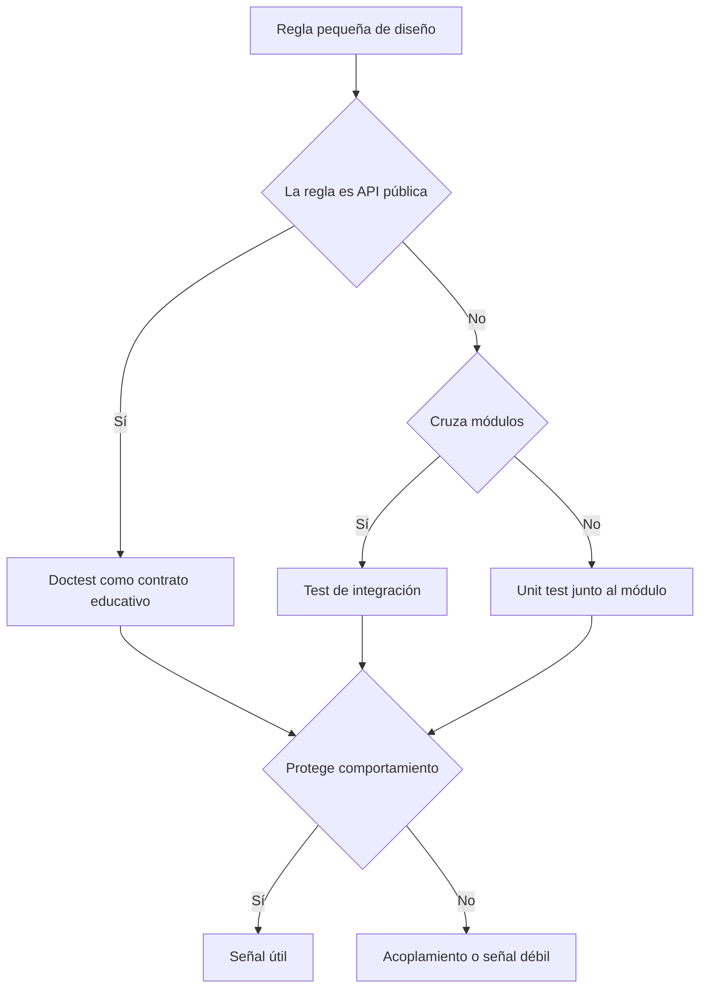

# Unit tests en Rust

**Estado:** draft

## Introducción

Las pruebas unitarias son la escala más cercana al diseño cotidiano. En Rust,
esa cercanía importa porque el lenguaje ya obliga a pensar en límites,
visibilidad, ownership y contratos de módulo. Un unit test bien escrito no
solo comprueba una función: también revela si el módulo tiene una frontera
comprensible.

Este capítulo estudia `#[test]`, módulos de prueba, funciones privadas,
doctests y casos límite como herramientas para diseñar comportamiento pequeño
sin perder el contexto del sistema.

## Concepto

Un unit test verifica una regla pequeña dentro de una unidad de diseño. Esa
unidad puede ser una función, un tipo, un método o un módulo. Lo importante no
es el tamaño físico del archivo, sino la frontera que la prueba intenta
proteger.

En Rust, una prueba unitaria suele vivir cerca del código:

- dentro del mismo archivo con `#[cfg(test)]`;
- dentro de un módulo `tests`;
- usando `super::*` cuando necesita observar detalles internos;
- usando doctests cuando el comportamiento público debe enseñarse desde la API.

Esa cercanía permite probar bordes internos sin hacer pública una API que no
debería ser pública. También puede tentar a probar detalles de implementación.
El criterio del capítulo es simple: una prueba puede vivir cerca del código,
pero debe proteger comportamiento.

## Problema

El error común es tratar unit tests como una colección de ejemplos felices.
Eso genera una suite rápida, pero frágil: muchas pruebas pasan, pocas explican
qué regla de diseño se está protegiendo.

Otro problema aparece cuando se prueba demasiado el interior. Si cada cambio de
implementación rompe la suite aunque el comportamiento siga igual, la prueba se
convierte en resistencia al diseño, no en evidencia.

El capítulo busca resolver esa tensión: usar la cercanía de las pruebas
unitarias para obtener señal rápida sin amarrar el código a detalles
accidentales.

## Alternativas

La primera alternativa es probar solo APIs públicas desde tests de integración.
Da una señal más parecida al uso real, pero puede volver difícil aislar un caso
límite pequeño y entender rápido la causa de una falla.

La segunda alternativa es probar cada función privada. Da mucha visibilidad,
pero puede congelar detalles internos y castigar refactors sanos.

La tercera alternativa es escribir doctests para todo. Sirven como ejemplos
públicos y documentación ejecutable, pero no reemplazan casos internos donde el
diseño necesita proteger una frontera.

La postura del curso es combinar escalas: unit tests cerca del módulo para
reglas pequeñas, doctests para comportamiento público y tests de integración
cuando la evidencia necesita cruzar límites.

## Invariantes

- Un unit test debe nombrar el comportamiento que protege.
- Un unit test debe mantener baja la distancia entre falla y causa probable.
- Un unit test puede observar detalles internos solo si eso mejora la señal de
  diseño.
- Un unit test no debe forzar a hacer pública una API interna.
- Un doctest debe enseñar uso público real, no solo compilar una llamada
  trivial.
- Una prueba rápida no es automáticamente una buena prueba.
- La suite debe permitir refactorizar sin romper comportamiento protegido.

## Límites del capítulo

Este capítulo no cubre todavía tests de integración, test doubles,
property-based testing, contract testing ni mutation testing. Esos temas tienen
capítulos propios.

Aquí se prepara el terreno para distinguir tres preguntas:

- ¿qué regla pequeña merece protección inmediata?
- ¿qué frontera del módulo debe permanecer interna?
- ¿qué comportamiento público conviene documentar como ejemplo ejecutable?

## Preparación para el modelo Rust

El modelo mínimo del capítulo representará decisiones sobre unidad, visibilidad
y señal de prueba. Debe permitir describir cuándo conviene usar un unit test,
cuándo un doctest y cuándo mover la evidencia a una escala más amplia.

No se agregan dependencias externas para esta especificación.

## Teoría

La teoría práctica del capítulo gira alrededor de una decisión: ¿la evidencia
que necesito pertenece a una prueba unitaria, a un doctest o a una prueba de
integración?

Un unit test es buena opción cuando la regla es pequeña, el contexto cabe en el
módulo y la falla apunta a una causa probable. Un doctest es mejor cuando el
comportamiento es parte de la API pública y debe enseñarse como ejemplo
ejecutable. Una prueba de integración es más honesta cuando la regla solo
aparece al cruzar módulos.

El riesgo principal es confundir cercanía con calidad. Poner una prueba junto
al código reduce distancia, pero no garantiza señal. La prueba sigue teniendo
que afirmar comportamiento observable.

## Diagrama



El archivo fuente del diagrama vive en
`diagrams/02-unit-tests-en-rust.mmd`.

## Complejidad

La complejidad de una prueba unitaria no debe medirse por cuántas líneas tiene,
sino por cuántas razones pueden explicar una falla. Una prueba que prepara diez
objetos, consulta estado global y depende del orden de ejecución quizá siga
siendo "unitaria" por ubicación, pero no por claridad.

La meta es mantener baja la distancia entre regla, escenario y expectativa. Si
esa distancia crece, el capítulo recomienda subir de escala en vez de forzar un
unit test.

## Implementación

El modelo vive en `src/unit_tests.rs`. La pieza central es
`UnitTestDecision`, que guarda:

- la regla observable;
- la frontera de diseño (`Function`, `Type` o `Module`);
- la visibilidad (`PublicApi` o `Internal`);
- los huecos conocidos.

Con esos datos, el modelo recomienda una escala y calcula una señal esperada.

```rust
use rust_testing::unit_tests::{
    RuleVisibility, TestScale, UnitBoundary, UnitTestDecision,
};

let decision = UnitTestDecision::new(
    "parsea una ruta pública desde texto",
    UnitBoundary::Type,
    RuleVisibility::PublicApi,
)?;

assert_eq!(decision.recommended_scale(), TestScale::Doctest);
# Ok::<(), rust_testing::unit_tests::UnitTestError>(())
```

## Pruebas

El módulo incluye pruebas unitarias para reglas internas del modelo y pruebas
de integración en `tests/unit_tests.rs` para observar la API pública desde
fuera del crate.

Los doctests también forman parte de la suite. Esto refuerza una idea del
capítulo: cuando una API pública enseña comportamiento, su documentación debe
compilar como ejemplo real.

## Benchmarks

No hay benchmark propio en este capítulo. El modelo clasifica decisiones de
testing y no contiene una operación cuyo costo sea pedagógicamente relevante.
El repositorio sigue ejecutando `cargo bench --all-targets` como verificación
de ruta, pero no inventa una medición artificial.

## Ejemplos

El ejemplo ejecutable vive en `examples/unit_tests.rs`:

```bash
cargo run --example unit_tests
```

El ejemplo imprime tres decisiones:

- una regla interna que conviene probar como unit test;
- una regla pública que conviene documentar como doctest;
- una regla que cruza módulos y debe moverse a integración.

## Ejercicios

Los ejercicios graduados se agregan en el siguiente corte del capítulo. Este
issue deja listo el material base, el diagrama y el ejemplo ejecutable.

## Referencias internas

- RFC-0001 §13: Rust como núcleo técnico.
- RFC-0001 §14: anatomía de cursos y capítulos.
- RFC-0001 §20: revisión humana diferida.

No está marcado como `reviewed` ni `published`.
