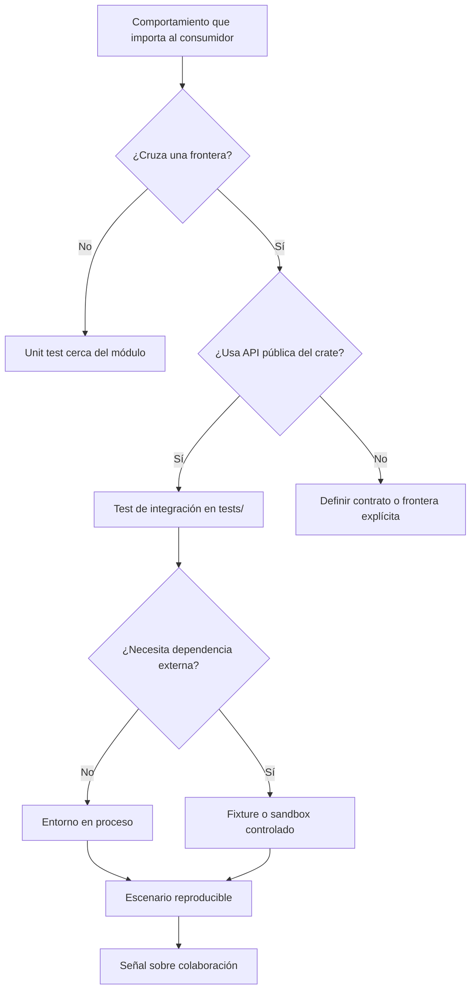

# Tests de integración

**Estado:** draft

## Introducción

Las pruebas de integración comprueban que partes diseñadas por separado
mantienen su promesa cuando se usan juntas. En Rust, normalmente viven en
`tests/` y consumen el crate como lo haría otra persona: por su API pública.

Este capítulo estudia esa distancia deliberada. No se trata de repetir cada
unit test desde fuera, sino de obtener evidencia de que los módulos, tipos y
flujos se conectan sin filtrar detalles internos.

## Concepto

Una prueba de integración verifica un contrato que aparece al cruzar una
frontera: entre módulos, entre capas de un crate o entre un adaptador y un
sistema controlado. El sujeto de la prueba es el comportamiento compuesto, no
la implementación privada de una pieza.

En un crate de Rust, un archivo bajo `tests/` se compila como consumidor
externo. Esa condición es valiosa: impide acceder a elementos privados y hace
visible si la API pública permite completar un flujo real.

## Problema

Un sistema puede tener unit tests impecables y aun así fallar al combinar sus
partes. Dos módulos pueden respetar sus reglas locales, pero discrepar sobre el
formato de un dato, el orden de una operación o la forma de reportar un error.

El extremo contrario también es costoso. Una suite que usa una base de datos,
red, reloj real y estado compartido para cada caso se vuelve lenta,
impredecible y difícil de diagnosticar. La intención del capítulo es encontrar
la mínima integración que produzca evidencia honesta.

## Alternativas

La primera alternativa es depender solo de unit tests. Da retroalimentación
rápida y local, pero no demuestra que las piezas colaboren por su contrato
público.

La segunda es probar todos los flujos contra infraestructura real. Se acerca al
entorno de producción, aunque introduce variables ajenas al contrato que se
quiere entender y vuelve la suite más frágil.

La tercera es diseñar pruebas de integración con fronteras explícitas,
dependencias controladas y escenarios completos pero pequeños. El curso adopta
esta alternativa: conserva realismo en el contrato sin convertir cada prueba
en una prueba de sistema.

## Invariantes

- Una prueba de integración usa la API pública que se desea proteger.
- Cada escenario nombra el flujo o contrato compuesto que verifica.
- La infraestructura externa se controla, sustituye o aísla de forma visible.
- Una falla debe acotar una frontera de colaboración, no ocultarse entre ruido
  ambiental.
- Un test de integración no reemplaza la evidencia local de los unit tests.
- La suite debe evitar depender del orden de ejecución, del reloj real o de
  datos compartidos sin una justificación explícita.

## Límites del capítulo

Este capítulo no enseña todavía contratos entre servicios desplegados, test
doubles en profundidad ni pruebas de rendimiento. Esos temas aparecen en los
capítulos de contract testing, test doubles y performance testing.

Aquí la pregunta central es más acotada: ¿qué comportamiento solo se vuelve
observable cuando el consumidor cruza la API pública y coordina más de un
módulo?

## Preparación para el modelo Rust

El modelo mínimo representará la frontera integrada, la superficie desde la
que se observa y los huecos que vuelven poco confiable una prueba. Con esos
datos podrá recomendar una estrategia de entorno y estimar la señal esperada.

No se agregan dependencias externas para esta especificación.

## Teoría

La diferencia entre una prueba unitaria y una de integración no es una medida
de tamaño ni de lentitud. Es la frontera que el escenario necesita cruzar para
producir evidencia. Si una regla se explica y falla dentro de un módulo, un
unit test da una señal más directa. Si el comportamiento existe solo cuando un
consumidor coordina varias piezas por una API pública, una prueba de
integración es la escala honesta.

El archivo bajo `tests/` ayuda a mantener esa honestidad. El compilador trata
la prueba como un crate externo, de modo que el escenario no puede apoyarse en
detalles privados. Esto hace que el test revele si el contrato público permite
completar la historia que promete.

La infraestructura no convierte por sí sola una prueba en integración. Una
base de datos real, una llamada de red o el reloj del sistema pueden ampliar el
alcance, pero también agregan ruido. El criterio es conservar solo las
dependencias necesarias para observar el contrato y controlar el resto.

## Diagrama



El archivo fuente del diagrama vive en
`diagrams/03-tests-de-integracion.mmd`.

## Complejidad

La complejidad de una prueba de integración aumenta con las fronteras y las
fuentes de variación, no solo con la cantidad de objetos que construye. Un
escenario de dos módulos con datos deterministas puede ser más fácil de
diagnosticar que una prueba de una función que consulta estado global.

Por eso conviene registrar riesgos visibles: estado compartido, entradas no
deterministas, infraestructura no controlada y ausencia de casos de falla. El
modelo del capítulo no elimina esos riesgos; los vuelve parte de la decisión.

## Implementación

El modelo vive en `src/integration_tests.rs`. La pieza central es
`IntegrationTestDecision`, que conserva:

- el escenario observable;
- la frontera integrada (`ModulePair`, `PublicWorkflow` o `ExternalAdapter`);
- la superficie desde la que el consumidor observa el contrato;
- los riesgos conocidos que pueden degradar la señal.

Con esos datos recomienda un entorno mínimo: en proceso, fixture o sandbox.

```rust
use rust_testing::integration_tests::{
    IntegrationBoundary, IntegrationEnvironment, IntegrationSurface,
    IntegrationTestDecision,
};

let decision = IntegrationTestDecision::new(
    "crea un pedido y reserva inventario por la API pública",
    IntegrationBoundary::PublicWorkflow,
    IntegrationSurface::PublicApi,
)?;

assert_eq!(decision.recommended_environment(), IntegrationEnvironment::InProcess);
# Ok::<(), rust_testing::integration_tests::IntegrationTestError>(())
```

## Pruebas

El módulo contiene pruebas unitarias para las reglas del modelo. El archivo
`tests/integration_tests.rs` consume la API pública desde fuera del crate, que
es la misma posición que tendría un usuario real de la librería.

Los doctests también se ejecutan para verificar que el ejemplo público no se
aleje del comportamiento del modelo.

## Benchmarks

No hay benchmark propio en este capítulo. El modelo clasifica decisiones de
testing y no ejecuta una operación cuyo costo sea relevante para el aprendizaje.
Crear una medición artificial ocultaría el objetivo del capítulo. El repositorio
conserva `cargo bench --all-targets` como verificación de ruta.

## Ejemplos

El ejemplo ejecutable vive en `examples/integration_tests.rs`:

```bash
cargo run --example integration_tests
```

Presenta tres escenarios: una colaboración entre módulos, un flujo público y
un adaptador externo. El último expone una dependencia no controlada para
mostrar por qué ejecutar más infraestructura no siempre produce mejor señal.

## Ejercicios

Los ejercicios graduados y sus soluciones se agregarán al cerrar el capítulo.
El lector deberá distinguir una frontera integrada, elegir el entorno mínimo y
detectar el riesgo que vuelve débil un escenario.

## Referencias internas

- RFC-0001 §13: Rust como núcleo técnico.
- RFC-0001 §14: anatomía de cursos y capítulos.
- RFC-0001 §20: revisión humana diferida.

No está marcado como `reviewed` ni `published`.
