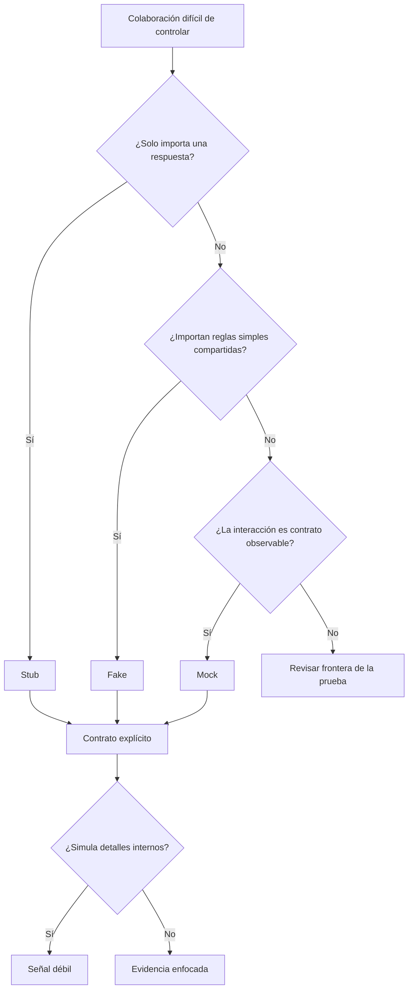

# Test doubles

**Estado:** draft

## Introducción

Un doble de prueba sustituye una colaboración del sistema para hacer un
escenario observable, controlable o reproducible. Puede ser una herramienta de
diseño o una forma de esconder un contrato mal definido. La diferencia está en
la intención y en la evidencia que el doble conserva.

## Concepto

Un stub devuelve respuestas preparadas. Un fake ofrece una implementación
funcional y liviana, normalmente en memoria. Un mock verifica interacciones
esperadas con una colaboración. Cada uno modifica el entorno de una prueba,
pero no responde a la misma pregunta.

El curso usa "doble" como término general y pide nombrar su clase solo cuando
esa clasificación aclara el contrato que se protege.

## Problema

Depender de red, base de datos, reloj real o proveedores externos puede volver
una prueba lenta y poco reproducible. Sin embargo, sustituir cada dependencia
también puede alejar el escenario de su contrato real y hacer que una suite
pase mientras la integración falla.

El problema no es usar dobles; es usarlos sin una frontera clara. Un mock que
verifica llamadas accidentales congela implementación. Un fake que cambia las
reglas de dominio entrega evidencia engañosa.

## Alternativas

La primera alternativa es usar infraestructura real siempre. Aumenta el
realismo, pero incorpora variación ambiental y costo de ejecución.

La segunda es reemplazar toda colaboración con mocks. Da control inmediato,
pero puede probar una coreografía privada en lugar de comportamiento.

La tercera es elegir el doble mínimo que conserva el contrato relevante: stub
para una respuesta conocida, fake para reglas simples compartidas y mock solo
cuando la interacción misma es parte del contrato. Esta es la postura del
capítulo.

## Invariantes

- Un doble debe declarar qué colaboración sustituye y qué contrato conserva.
- El doble no debe inventar reglas de dominio distintas a las del sistema.
- Un mock solo verifica interacción cuando esa interacción es observable para
  el contrato.
- Un fake debe ser simple, determinista y explícito sobre sus límites.
- Un stub debe responder lo necesario para el escenario, sin simular de más.
- Si una prueba solo pasa por detalles de llamadas internas, su señal es débil.

## Límites del capítulo

Este capítulo no sustituye las pruebas de integración ni enseña un framework
de mocking. Tampoco cubre contratos entre servicios desplegados. Se concentra
en decidir cuándo una colaboración puede controlarse sin perder evidencia.

## Preparación para el modelo Rust

El modelo mínimo representará el tipo de doble, el contrato que conserva y los
riesgos que pueden degradar la señal. No se agregan dependencias externas para
esta especificación.

## Teoría

Elegir un doble empieza por la pregunta que hace la prueba. Si solo necesita
una respuesta estable, un stub evita preparar infraestructura que no aporta al
caso. Si necesita reglas simples de una colaboración, un fake puede ser más
legible que una cadena de respuestas preparadas. Si el contrato exige que se
publique un evento o se solicite una autorización, un mock puede verificar esa
interacción sin convertir toda la implementación en una coreografía rígida.

La correspondencia importa: stub con respuesta, fake con comportamiento y mock
con interacción. Cuando no coincide, la prueba puede compilar y aun así no
explicar qué contrato protege.

## Diagrama



El archivo fuente vive en `diagrams/04-test-doubles.mmd`.

## Complejidad

El costo de un doble no es solo escribirlo. También hay que mantener su
equivalencia con el contrato. Un fake pequeño suele ser barato; un fake que
replica una base de datos entera ya es otro sistema que puede divergir. Los
mocks muy detallados tienen un costo parecido: convierten refactors sanos en
fallas sin relación con el comportamiento público.

## Implementación

`src/test_doubles.rs` contiene `DoubleDecision`. Registra la colaboración, la
clase de doble, el contrato conservado y riesgos como acoplamiento a
implementación o reglas de dominio divergentes.

```rust
use rust_testing::test_doubles::{DoubleContract, DoubleDecision, DoubleKind};

let decision = DoubleDecision::new(
    "proveedor de tipo de cambio",
    DoubleKind::Stub,
    DoubleContract::Response,
)?;

assert_eq!(decision.kind(), DoubleKind::Stub);
# Ok::<(), rust_testing::test_doubles::DoubleDecisionError>(())
```

## Pruebas

El módulo incluye pruebas unitarias y `tests/test_doubles.rs` consume su API
pública desde fuera del crate. El doctest verifica que el ejemplo del contrato
también compile.

## Benchmarks

No hay benchmark propio: el modelo clasifica decisiones y medirlo no representa
el costo de un doble en un sistema real. La ruta `cargo bench --all-targets`
sigue ejecutándose para comprobar que el repositorio mantiene esa capacidad.

## Ejemplos

```bash
cargo run --example test_doubles
```

El ejemplo compara un stub, un fake y un mock, incluido un mock que pierde
señal cuando observa detalles accidentales.

## Ejercicios

Los ejercicios graduados y soluciones se agregan al cerrar el capítulo.

## Referencias internas

- RFC-0001 §13: Rust como núcleo técnico.
- RFC-0001 §14: anatomía de cursos y capítulos.
- RFC-0001 §20: revisión humana diferida.

No está marcado como `reviewed` ni `published`.
