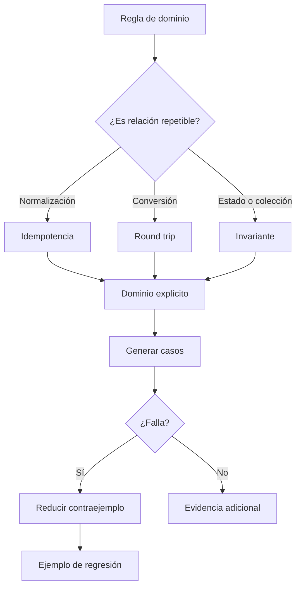

# Property-based testing

**Estado:** draft

## Introducción

Property-based testing comprueba una regla que debe mantenerse para muchos
datos, en vez de afirmar solo unos cuantos ejemplos elegidos a mano. Su valor
no es generar casos al azar: es obligar a declarar una propiedad del dominio y
conservar el contraejemplo más pequeño que la contradice.

## Concepto

Una propiedad relaciona entradas y resultados. Por ejemplo, normalizar texto
dos veces debe dar el mismo resultado que normalizarlo una sola vez. Un
generador propone entradas dentro de un dominio; shrinking reduce una falla a
un caso que se pueda entender y convertir en ejemplo de regresión.

## Problema

Los ejemplos concretos cubren historias conocidas, pero suelen omitir
combinaciones, bordes y datos inesperados. Al mismo tiempo, una propiedad vaga
puede producir muchos casos sin enseñar nada: "no debe fallar" no describe un
contrato.

## Alternativas

Probar solo ejemplos hace la suite fácil de leer, pero deja espacio para
contraejemplos no imaginados. Generar datos sin propiedad aumenta volumen sin
evidencia. El capítulo adopta propiedades pequeñas, dominios explícitos y
contraejemplos reproducibles, complementando en vez de reemplazar ejemplos.

## Invariantes

- Una propiedad debe expresar una relación observable del dominio.
- El generador debe declarar el dominio que representa.
- Un contraejemplo se conserva como información, no como ruido aleatorio.
- Shrinking busca claridad diagnóstica, no ocultar la falla.
- Las propiedades no sustituyen ejemplos de negocio ni tests de integración.

## Límites del capítulo

No se introduce un framework externo ni se promete probar todos los valores
posibles. El objetivo es aprender a formular propiedades, razonar sobre sus
dominios y leer contraejemplos honestos.

## Preparación para el modelo Rust

El modelo representará la clase de propiedad, el dominio de generación y los
riesgos que debilitan la señal. No se agregan dependencias externas.

## Teoría

Una propiedad útil es más precisa que una expectativa genérica y más amplia que
un ejemplo aislado. La idempotencia protege transformaciones que no deben seguir
cambiando; un round trip protege conversiones; un invariante protege una
relación que debe mantenerse ante muchas entradas.

El generador no sustituye el criterio de dominio. Primero se decide qué valores
son válidos, qué bordes importan y cuál sería un contraejemplo explicable. Solo
entonces tiene sentido explorar más casos.

## Diagrama



El archivo fuente vive en `diagrams/05-property-based-testing.mmd`.

## Complejidad

El costo principal está en comprender una falla. Un dominio grande y una
propiedad vaga producen contraejemplos difíciles de interpretar. Por eso el
capítulo favorece dominios acotados, bordes declarados y resultados
reproducibles antes de aumentar el volumen de casos.

## Implementación

`PropertyDecision` en `src/property_testing.rs` guarda el enunciado, la clase
de propiedad, el dominio y los huecos conocidos. No reemplaza un framework de
generación: hace visible la decisión que debe existir antes de usarlo.

## Pruebas

El módulo tiene pruebas unitarias, un consumidor externo en
`tests/property_testing.rs` y un doctest para el uso público.

## Benchmarks

No hay benchmark propio. Medir este modelo no mide el costo de generar datos ni
de reducir contraejemplos en un sistema real. `cargo bench --all-targets` se
mantiene como verificación de ruta.

## Ejemplos

```bash
cargo run --example property_testing
```

## Ejercicios

Los ejercicios y soluciones graduadas se agregan al cerrar el capítulo.

## Referencias internas

- RFC-0001 §13: Rust como núcleo técnico.
- RFC-0001 §14: anatomía de cursos y capítulos.
- RFC-0001 §20: revisión humana diferida.

No está marcado como `reviewed` ni `published`.
