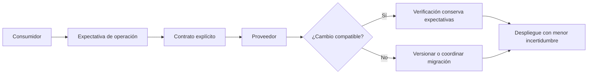

# Contract testing

**Estado:** draft

## Introducción

Contract testing verifica una promesa compartida entre quien consume una API y
quien la provee. No prueba toda la infraestructura: protege las expectativas
que cruzan ese límite y hace visible cuándo una evolución deja de ser
compatible.

## Concepto

Un contrato describe solicitudes, respuestas, errores y reglas de
compatibilidad observables. El consumidor declara qué necesita; el proveedor
verifica que puede cumplirlo. La evidencia está en la promesa compartida, no en
la implementación interna de ninguno.

## Problema

Dos servicios pueden pasar sus suites locales y fallar al desplegarse juntos:
un campo cambió de significado, un error dejó de existir o una respuesta ya no
es aceptada. Probar cada combinación en un entorno completo es caro y lento,
pero no probar el límite deja la incompatibilidad para producción.

## Alternativas

Solo usar integración de extremo a extremo da realismo, pero diagnóstico lento.
Usar mocks internos da control, pero puede inventar un proveedor ficticio. El
capítulo adopta contratos explícitos y pequeños que complementan integración y
prueban compatibilidad antes del despliegue.

## Invariantes

- El contrato nombra consumidor, proveedor y operación observable.
- Un cambio compatible conserva expectativas existentes.
- Un cambio incompatible se declara, versiona o coordina explícitamente.
- El contrato no expone detalles internos sin valor para el consumidor.
- Los errores esperados también son parte del contrato.

## Límites del capítulo

No enseña un broker ni un framework específico. Se concentra en formular el
contrato y razonar sobre compatibilidad sin agregar dependencias externas.

## Preparación para el modelo Rust

El modelo representará la dirección del contrato, su compatibilidad y los
riesgos que reducen la confianza de la verificación.

## Teoría

El contract testing parte de una frontera que ya existe: un consumidor necesita
una operación y un proveedor la promete. La pregunta no es si ambos servicios
funcionan aislados, sino si su lenguaje compartido sigue teniendo el mismo
significado al evolucionar.

La compatibilidad hacia atrás permite que consumidores existentes sigan usando
el contrato. Cuando una modificación no lo permite, la solución no es ocultarla
en un mock: se necesita una versión, una migración o coordinación explícita.

## Diagrama



El archivo fuente vive en `diagrams/06-contract-testing.mmd`.

## Complejidad

El costo de un contrato crece con el número de consumidores y con la ambigüedad
de sus expectativas. Una operación pequeña con errores explícitos suele ser más
mantenible que una respuesta muy flexible cuyo significado depende de cada
cliente.

## Implementación

`ContractDecision` en `src/contract_testing.rs` guarda la operación, la
dirección del contrato, su compatibilidad y huecos como un cambio incompatible
sin versionado o la ausencia de casos de error.

```rust
use rust_testing::contract_testing::{
    Compatibility, ContractDecision, ContractDirection,
};

let contract = ContractDecision::new(
    "consulta saldo",
    ContractDirection::ConsumerToProvider,
    Compatibility::BackwardCompatible,
)?;

assert_eq!(contract.compatibility(), Compatibility::BackwardCompatible);
# Ok::<(), rust_testing::contract_testing::ContractError>(())
```

## Pruebas

El módulo incluye pruebas unitarias, un consumidor externo en
`tests/contract_testing.rs` y un doctest. El test externo garantiza que el
modelo se pueda observar solo desde su API pública.

## Benchmarks

No hay benchmark propio. El modelo clasifica decisiones y no representa el
costo de verificar contratos distribuidos reales. `cargo bench --all-targets`
se conserva como verificación de ruta.

## Ejemplos

```bash
cargo run --example contract_testing
```

El ejemplo muestra un contrato compatible y otro que es débil porque cambia sin
versionarse.

## Ejercicios

Los ejercicios graduados y sus soluciones se agregan al cerrar el capítulo.

## Referencias internas

- RFC-0001 §13: Rust como núcleo técnico.
- RFC-0001 §14: anatomía de cursos y capítulos.
- RFC-0001 §20: revisión humana diferida.

No está marcado como `reviewed` ni `published`.
