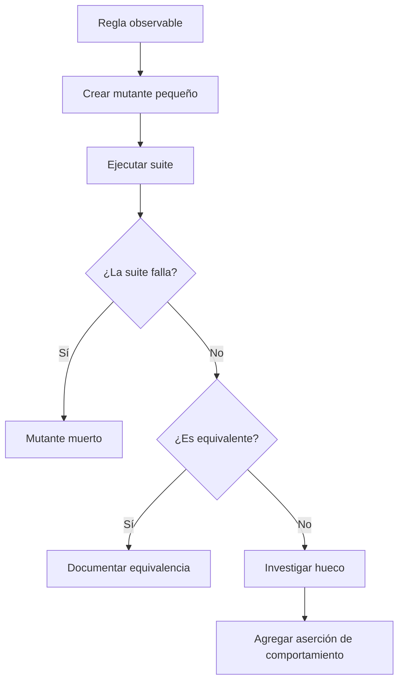

# Mutation testing

**Estado:** draft

## Introducción

Mutation testing modifica deliberadamente una regla pequeña y pregunta si la
suite nota el cambio. Un mutante que sobrevive no es una calificación del
equipo: es una pista de que falta una expectativa observable o que el mutante
es equivalente al comportamiento original.

## Concepto

Un mutante cambia una condición, un operador o una respuesta. La suite lo mata
si falla; sobrevive si todos los tests siguen pasando. El resultado sirve para
examinar la fuerza de la evidencia, no para perseguir una cifra aislada.

## Problema

La cobertura puede ejecutar una línea sin afirmar su regla. Una suite extensa
puede dejar sobrevivir cambios relevantes. El extremo opuesto es forzar una
cifra de mutación sin investigar equivalencias ni costo de diagnóstico.

## Alternativas

Confiar solo en cobertura mide ejecución. Revisar manualmente cada línea da
criterio, pero escala mal. El capítulo combina mutantes pequeños, investigación
de supervivientes y ejemplos de regresión cuando la regla sí importa.

## Invariantes

- Un mutante sobreviviente se investiga antes de agregar una prueba.
- Un mutante equivalente no exige una prueba artificial.
- La nueva prueba debe afirmar comportamiento, no la forma del código.
- La tasa de mutación orienta conversación, no reemplaza criterio humano.

## Límites del capítulo

No instala una herramienta de mutación. Se enfoca en el razonamiento previo:
qué cambio importa, qué evidencia debería detectarlo y cuándo un mutante no
representa una diferencia observable.

## Preparación para el modelo Rust

El modelo describirá el tipo de mutación, su resultado y los riesgos de
interpretar la supervivencia sin contexto.

## Teoría

Un mutante muerto da evidencia de que la suite distingue un cambio relevante.
Uno que sobrevive inicia una investigación: quizá falta una aserción de
comportamiento, quizá solo se ejecutó la línea o quizá el mutante es equivalente
y no cambia lo que el consumidor puede observar.

La práctica sana no es escribir un test por cada superviviente. Es clasificar
el resultado, decidir si la regla importa y, solo entonces, agregar una prueba
que explique el comportamiento faltante.

## Diagrama



El archivo fuente vive en `diagrams/07-mutation-testing.mmd`.

## Complejidad

El costo está en diagnosticar supervivientes. Mutar demasiadas reglas sin
contexto produce una lista larga y poco accionable. Conviene empezar por reglas
de negocio, condiciones y bordes cuyo cambio tendría una consecuencia clara.

## Implementación

`MutationDecision` en `src/mutation_testing.rs` representa la regla mutada, el
tipo de mutación, el resultado y huecos como cobertura sin aserción o una
equivalencia no investigada.

## Pruebas

El módulo incluye pruebas unitarias, un consumidor externo y un doctest para
verificar su API pública.

## Benchmarks

No hay benchmark propio. El modelo no mide el costo de una herramienta real de
mutación; `cargo bench --all-targets` mantiene la verificación de ruta.

## Ejemplos

```bash
cargo run --example mutation_testing
```

## Ejercicios

Los ejercicios y soluciones graduadas se agregan al cerrar el capítulo.

## Referencias internas

- RFC-0001 §13: Rust como núcleo técnico.
- RFC-0001 §14: anatomía de cursos y capítulos.
- RFC-0001 §20: revisión humana diferida.

No está marcado como `reviewed` ni `published`.
