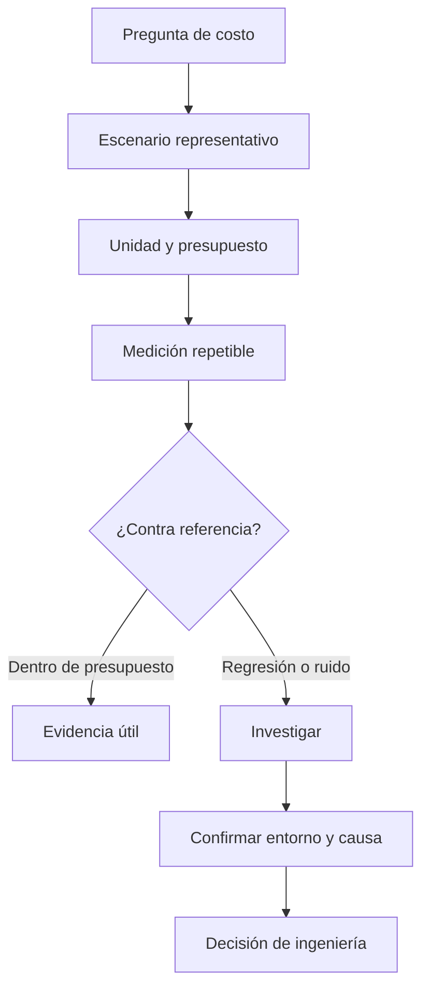

# Performance testing

**Estado:** draft

## Introducción

Performance testing responde una pregunta de costo con una medición diseñada
para esa pregunta. Un benchmark no demuestra que producción sea rápida: ofrece
evidencia local bajo condiciones explícitas y ayuda a detectar regresiones.

## Concepto

Una medición compara un escenario, una carga y un presupuesto. El resultado
debe separar señal de ruido y registrar qué se midió. Una regresión es un cambio
relevante respecto a una referencia, no una variación aislada de una ejecución.

## Problema

Medir una operación trivial sin decisión asociada crea números atractivos pero
inútiles. A su vez, concluir capacidad de producción desde una laptop ignora
red, datos, concurrencia y despliegue.

## Alternativas

No medir deja las regresiones ocultas. Medir todo sin hipótesis añade ruido. El
capítulo adopta escenarios representativos, presupuestos explícitos y lectura
prudente de resultados, complementada por observabilidad en producción.

## Invariantes

- Toda medición declara escenario, unidad y presupuesto.
- Una variación se compara contra una referencia antes de llamarse regresión.
- El entorno de medición se documenta cuando afecta la lectura.
- Un benchmark local no se presenta como capacidad de producción.

## Límites del capítulo

No configura infraestructura de carga ni observabilidad distribuida. Prepara el
criterio para decidir qué medir, cómo interpretar ruido y cuándo investigar.

## Preparación para el modelo Rust

El modelo describirá el escenario, el presupuesto y el resultado de una
medición sin agregar dependencias externas.

## Teoría

Antes de medir conviene formular una hipótesis: qué operación importa, qué
unidad representa su costo y cuál es el presupuesto que protege una experiencia
o un recurso concreto. El número aislado no es la conclusión; la comparación
con una referencia y el contexto son la evidencia.

Una regresión requiere investigación. Puede venir de un cambio real, de ruido
ambiental o de un escenario que dejó de representar el flujo que se quería
proteger. Un benchmark local ayuda a detectar, pero no sustituye métricas de
producción.

## Diagrama



El archivo fuente vive en `diagrams/08-performance-testing.mmd`.

## Complejidad

La complejidad aumenta con datos, concurrencia y dependencias externas. Una
medición pequeña debe declarar qué deja fuera. Esto evita que una mejora local
se interprete como una garantía sobre el sistema completo.

## Implementación

`MeasurementDecision` en `src/performance_testing.rs` registra escenario,
unidad, resultado y riesgos como línea base ausente o conclusión indebida sobre
producción.

## Pruebas

El módulo incluye pruebas unitarias, un consumidor externo y un doctest para
su API pública.

## Benchmarks

No hay benchmark propio: el modelo describe cómo razonar sobre mediciones y no
representa el rendimiento de un flujo de negocio. `cargo bench --all-targets`
mantiene la verificación de ruta.

## Ejemplos

```bash
cargo run --example performance_testing
```

## Ejercicios

Los ejercicios y soluciones graduadas se agregan al cerrar el capítulo.

## Referencias internas

- RFC-0001 §13: Rust como núcleo técnico.
- RFC-0001 §14: anatomía de cursos y capítulos.
- RFC-0001 §20: revisión humana diferida.

No está marcado como `reviewed` ni `published`.
