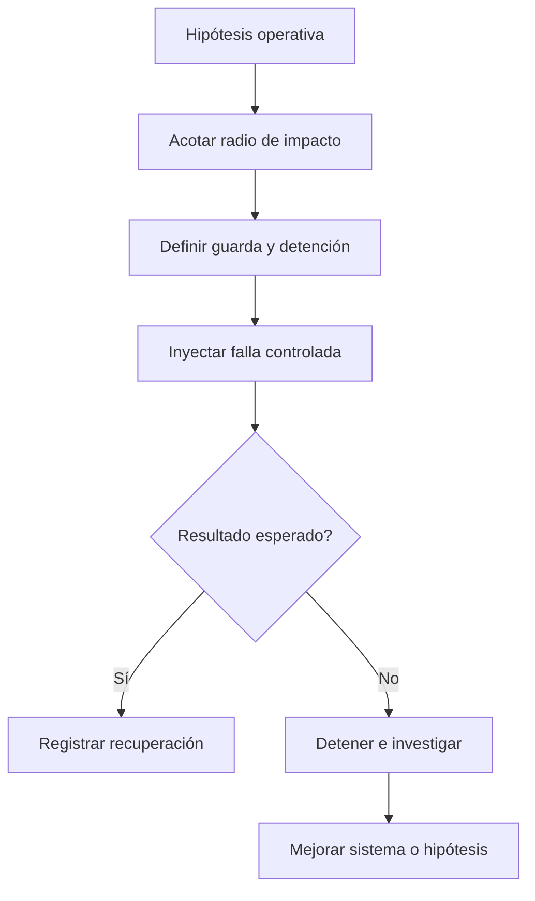

# Chaos testing

**Estado:** draft

## Introducción

Chaos testing introduce una falla controlada para comprobar una hipótesis sobre
el comportamiento del sistema. No busca romper por espectáculo: busca reducir
incertidumbre antes de que una falla real elija el momento y las condiciones.

## Concepto

Un experimento declara alcance, hipótesis, inyección de falla y señal esperada.
Puede simular una dependencia lenta, una respuesta inválida o una interrupción
acotada. El resultado sirve para aprender si el sistema degrada, se recupera o
expone una fragilidad.

## Problema

Los flujos felices no demuestran recuperación. Pero inyectar fallas sin límite
ni observación puede causar daño y producir conclusiones confusas. La técnica
necesita guardas, reversibilidad y una pregunta operativa concreta.

## Alternativas

Esperar incidentes reales enseña tarde. Simular todo en unit tests pierde el
contexto operacional. El capítulo adopta experimentos pequeños, controlados y
reversibles que complementan pruebas locales y observabilidad.

## Invariantes

- Todo experimento declara hipótesis y señal de recuperación.
- El radio de impacto está acotado antes de inyectar la falla.
- Existe una forma explícita de detener o revertir el experimento.
- Un resultado inesperado se investiga, no se normaliza.
- Ningún ejercicio autoriza afectar producción.

## Límites del capítulo

No despliega herramientas de caos ni ejecuta fallas contra servicios reales. Se
concentra en el criterio para diseñar experimentos seguros y legibles.

## Preparación para el modelo Rust

El modelo representará la hipótesis, el alcance, el tipo de falla y los riesgos
que impiden interpretar un experimento con confianza.

## Teoría

Un experimento de caos empieza con una afirmación falsable: ante una falla
concreta, el sistema debe conservar, degradar o recuperar cierto comportamiento.
El alcance pequeño permite observar la señal sin convertir el experimento en un
incidente. El resultado inesperado no se descarta: es precisamente la evidencia
que justifica investigar.

## Diagrama



El archivo fuente vive en `diagrams/09-chaos-testing.mmd`.

## Complejidad

La complejidad está en controlar el radio de impacto y observar recuperación.
Una falla en entorno compartido o sin condición de detención no es un ejercicio
pedagógico seguro. El modelo hace visible esa diferencia antes de ejecutar nada.

## Implementación

`ChaosDecision` en `src/chaos_testing.rs` conserva hipótesis, tipo de falla,
radio de impacto, resultado y huecos de seguridad.

## Pruebas

El módulo incluye pruebas unitarias, un consumidor externo y un doctest. No
inyecta fallas reales: modela la decisión previa al experimento.

## Benchmarks

No hay benchmark propio. `cargo bench --all-targets` verifica la ruta, pero no
pretende medir la resiliencia de infraestructura real.

## Ejemplos

```bash
cargo run --example chaos_testing
```

## Ejercicios

Los ejercicios y soluciones graduadas se agregan al cerrar el capítulo.

## Referencias internas

- RFC-0001 §13: Rust como núcleo técnico.
- RFC-0001 §14: anatomía de cursos y capítulos.
- RFC-0001 §20: revisión humana diferida.

No está marcado como `reviewed` ni `published`.
