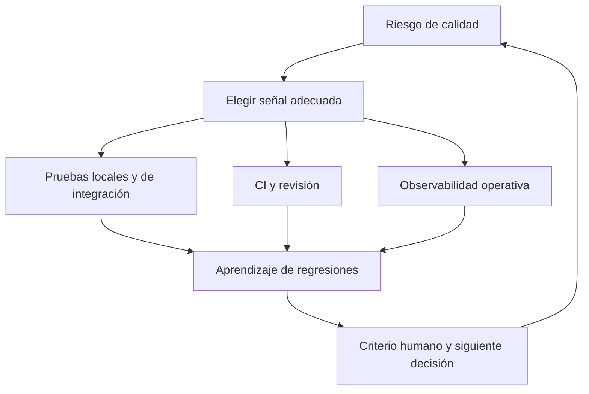

# Estrategia de calidad para sistemas reales

**Estado:** draft

## Introducción

La calidad de un sistema real no sale de una sola técnica. Aparece cuando las
pruebas, revisión, integración continua, observabilidad y criterio humano se
refuerzan sin fingir que alguno reemplaza al resto.

## Concepto

Una estrategia de calidad asigna cada señal a la decisión que puede sostener:
unit tests para reglas locales, integración para colaboración, CI para evitar
regresiones conocidas, observabilidad para el sistema desplegado y revisión
humana para riesgos que la automatización no entiende por sí sola.

## Problema

Acumular herramientas sin una frontera clara produce ruido, duplicación y falsa
seguridad. Confiar solo en revisión humana no escala; confiar solo en una suite
verde ignora datos, operación y cambios de intención.

## Alternativas

Una pirámide rígida puede ser útil como imagen, pero no decide por dominio.
Medir cobertura como objetivo simplifica el reporte, pero puede ocultar huecos.
El capítulo adopta una estrategia por riesgo y señal: cada técnica debe tener
una pregunta explícita que responder.

## Invariantes

- Cada señal de calidad declara qué riesgo reduce y qué no puede demostrar.
- Un fallo en producción alimenta nuevas pruebas, alertas o decisiones de diseño.
- Una suite verde no equivale a aprobación humana ni a salud operativa.
- La estrategia evoluciona con el sistema y sus riesgos reales.
- La automatización informa; el criterio humano decide.

## Límites del capítulo

No prescribe una herramienta de CI ni una plataforma de observabilidad. Integra
los conceptos del curso en una forma de decidir, revisar y aprender.

## Preparación para el modelo Rust

El modelo representará una señal, el riesgo que reduce y sus límites, sin
agregar dependencias externas.

## Teoría

Una estrategia sana no pregunta cuál técnica es la mejor en abstracto. Pregunta
qué riesgo importa ahora y qué señal puede reducir la incertidumbre con menor
costo. Las técnicas se complementan: una prueba local no observa producción;
una alerta no explica por sí sola la intención; una revisión no sustituye una
regresión ejecutable.

La retroalimentación completa forma un ciclo. Incidentes y observabilidad
generan nuevas hipótesis; esas hipótesis se convierten en pruebas, contratos,
guardas de CI o decisiones de diseño revisables por personas.

## Diagrama



El archivo fuente vive en `diagrams/10-estrategia-de-calidad.mmd`.

## Complejidad

Una estrategia puede degradarse por duplicar señales que responden la misma
pregunta o por dejar sin dueño los riesgos operativos. El modelo no calcula una
calificación global: obliga a nombrar decisión, señal y límite antes de sumar
más automatización.

## Implementación

`StrategyDecision` en `src/quality_strategy.rs` relaciona una decisión con su
fuente de señal y el riesgo que reduce. También registra huecos como tratar una
automatización como aprobación humana.

## Pruebas

El módulo incluye pruebas unitarias, un consumidor externo y un doctest para
su API pública.

## Benchmarks

No hay benchmark propio. El modelo clasifica decisiones de calidad y medirlo
no representa la salud de un sistema. `cargo bench --all-targets` se conserva
como verificación de ruta.

## Ejemplos

```bash
cargo run --example quality_strategy
```

## Ejercicios

Los ejercicios y soluciones graduadas se agregan al cerrar el capítulo.

## Referencias internas

- RFC-0001 §13: Rust como núcleo técnico.
- RFC-0001 §14: anatomía de cursos y capítulos.
- RFC-0001 §20: revisión humana diferida.

No está marcado como `reviewed` ni `published`.
